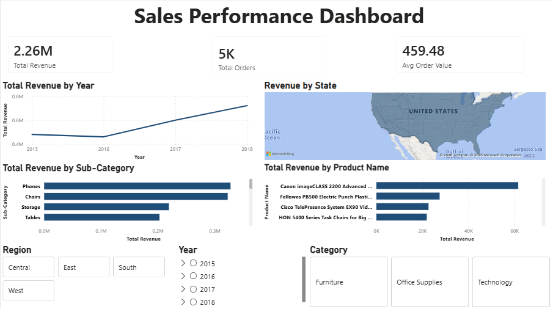

# Sales Performance Dashboard (Power BI)

Interactive dashboard analyzing sales trends, revenue growth, and regional 
performance using the Sample Superstore dataset.

## Features
- KPI cards: Total Revenue, Total Orders, Average Order Value
- Revenue trend by year (line chart)
- Revenue by state (map visualization)
- Revenue by sub-category and top products (bar charts)
- Interactive slicers: Region, Year, Category

## Tools Used
Power BI, Power Query, DAX, Microsoft Excel/CSV

## Dashboard Preview

## Files
- `Sales_Performance_Dashboard.pbix` - Power BI file
- `train.csv` - Source dataset
